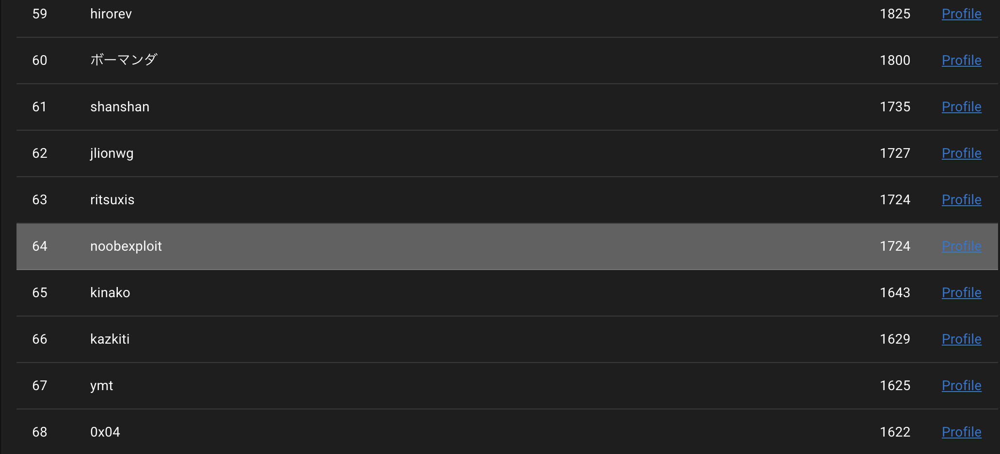
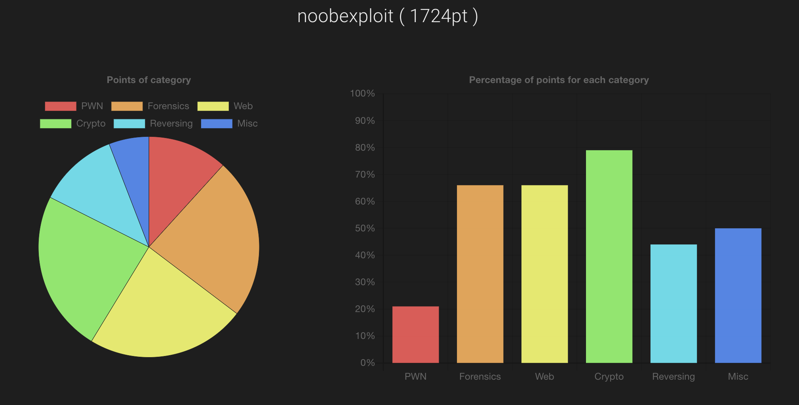

waniCTF に参加しました。

https://wanictf.org/

最近課題で忙殺されていて、ksnctf も解き終わっていないですが、ちょっと解けそうな問題が多そうだったため、参加してみました。

この CTF は初心者向けの CTF になっていて、ヒントが多めにもらえるやさしめの CTF です。

結果は 64 / 242 だったよう


スコアの詳細


うーん、pwn が苦手ですね。reverse も苦手だと感じました。

# Crypt

## Veni, vidi

シザー暗号ですね。FLAG{...}の形式の文字列になっているため、F -> S のシフト数を考えます

## exclusive

xor で暗号化された文を元に戻す問題です。

暗号化に使ったであろう encrypt.py と 暗号文であろう output.txt が配られています。

encrypt.py

```python
key = "REDACTED"
flag = "FAKE{this_is_fake_flag}"

assert len(key) == len(flag) == 57
assert flag.startswith("FLAG{") and flag.endswith("}")
assert key[0:3] * 19 == key


def encrypt(s1, s2):
    assert len(s1) == len(s2)

    result = ""
    for c1, c2 in zip(s1, s2):
        result += chr(ord(c1) ^ ord(c2))
    return result


ciphertext = encrypt(flag, key)
print(ciphertext, end="")

```

encrypt.py の以下の部分をみてみると、どうやら xor のキーとなる文章は 3 文字の繰り返しのようですね。

```python
assert key[0:3] * 19 == key
```

わざわざ assert で保証してくれています。
（ちなみに、REDACTED は[削除済み]という意味)

ascii の 3 文字の範囲内なら総当たりで探せそうです。

総当たりで 3 文字を作り、

-   output.txt の最初の三文字

と

-   「FLA」と key で xor したもの

が一致するような key を探します。

これで無事 key が発見でき、flag が取り出せました。

exploit.py

```python
def encrypt(s1, s2):
  assert len(s1) == len(s2)

  result = ""
  for c1, c2 in zip(s1, s2):
      result += chr(ord(c1) ^ ord(c2))
  return result

if __name__ == "__main__":
  output = ""
  with open("output.txt", "r") as f:
    output = f.read()

  output_boutou = output[0:3]

  key_head = ""

  for a in range(32, 126):
    for b in range(32, 126):
      for c in range(32, 126):
        key_tmp = chr(a) + chr(b) + chr(c)
        print(key_tmp)
        encrypted = encrypt("FLA", key_tmp)
        if output_boutou == encrypted:
          key_head = key_tmp
          print("KEY FOUNDED:", key_head)
          break

  plain_text = encrypt(output, key_head * 19)
  print(plain_text)
```

## Basic RSA

これは本当にベーシックな RSA 暗号の計算でした。

p \* q

から始まり、

暗号化の計算

暗号文の複合

の計算を順にこなして FLAG 獲得です。

余談ですが、nc でサーバーにアクセスしたときに表示されるやつ(?)がオサレでした。

## LCG crack

線形合同法の予測です。

好きなだけ.next()の値が得られ、

.next()の値を十分に取り出したら、予測フェーズに入り、

10 個ぐらい予想が当たればフラグがもらえます。

線形合同法の予測のプログラムは色々な人が載せてくれているため、

それを使ってときました。

実際にはこちらの方のブログからお借りしました。

https://satto.hatenadiary.com/entry/solve-LCG

初めて pwntools を使って解いたため、

この問題を解くこと以上に pwntools の扱いに時間がかかりました。

exploit.py

```python
from pwn import *
from Crypto.Util.number import inverse, GCD
from functools import reduce
import re

class LCG:
    # X_{n+1} = (A \times X_n + B) \bmod M
    A = 9605000926055143081 # multiplier
    B = 9749676397194673813 # increment
    M = 18446744073709551615 # modulus

    def __init__(self, seed):
        # start value
        self.state = seed

    def next(self):
        self.state = (self.A * self.state + self.B) % self.M
        return self.state

    def get_parameters(self):
        return self.A, self.B, self.M

def solve_unknown_increment(states, A, M):
    B = (states[1] - A * states[0]) % M
    return B

def solve_unknown_multiplier(states, M):
    A = (states[2] - states[1]) * inverse((states[1] - states[0]), M)
    return A

def prediction_test(PRNGs, states, A, B, M):
    next_value = PRNGs.next()
    predicted_value = (A * states[-1] + B) % M

    for i, state in enumerate(states):
        print('X_{0}: {1}'.format(i, state))

    print('\nnext value: {}'.format(next_value))
    print('predicted value: {}'.format(predicted_value))

    if next_value == predicted_value:
        print('correct!')
    else:
        print('incorrect!')

def output_example():
    states = [114514]
    PRNGs = LCG(states[0])
    states.append(PRNGs.next())
    states.append(PRNGs.next())
    states.append(PRNGs.next())
    states.append(PRNGs.next())

    A, B, M = PRNGs.get_parameters()

    prediction_test(PRNGs, states, A, B, M)

def solve_unknown_modulus(states):
    diffs = [X_1 - X_0 for X_0, X_1 in zip(states, states[1:])]
    multiples_of_M = [T_2 * T_0 - T_1 ** 2 for T_0, T_1, T_2, in zip(diffs, diffs[1:], diffs[2:])]

    # GCD(GCD(multiples_of_M[0],multiples_of_M[1]), multiples_of_M[2])
    M = reduce(GCD, multiples_of_M)
    return M


def send_cmd_num(io, num):
  io.sendline(str(num))
  io.recv()
  return ret

def get_next_number(io):
  io.sendline(str(1))
  ret = io.recvline()
  return ret.decode('utf-8').rstrip()


def estimate_next(state):
    M = solve_unknown_modulus(states)
    A = solve_unknown_multiplier(states, M)
    B = solve_unknown_increment(states, A, M)
    return (A * states[-1] + B) % M

if __name__ == "__main__":

  io = remote('lcg.wanictf.org', 50001)
  io.recvuntil('> ')

  states = []
  while len(states) <= 7:
    ret = get_next_number(io).rstrip()
    ret = re.sub(r"[^\d]", '', ret)
    print(ret.strip())
    if len(ret) > 3:
      x = int(ret.rstrip())
      states.append(x)
    io.recv()

  for n in range(10):
    print("collected_states:", states)

    M = solve_unknown_modulus(states)
    A = solve_unknown_multiplier(states, M)
    B = solve_unknown_increment(states, A, M)
    predicted_value = (A * states[-1] + B) % M

    if n == 0:
      io.sendline(str(2))
      ret = io.recv()
      print(ret)
    io.sendline(str(predicted_value))
    ret = io.recv()
    print(ret)
    if "Correct" in ret.decode('utf-8'):
      print("corrected!")
      states.pop(0)
      states.append(predicted_value)
    else:
      print(ret)
      print("failed!")
      break
    # io.interactive()

  ret = io.recv()
  print(ret)

  print(ret.decode('utf-8'))

```

# Forensics

## logged_flag

キーロガーをみると、FLAG{...}という文字列を売っていることが確認できます。

## ALLIGATOR_01

メモリダンプが配布されています。

volatility というツールを使って解く問題のようです。

初めて使うツールですし、メモリダンプがどういったことまでできるのかわかりませんが、

見様見真似でコマンドを色々打って flag を見つけました。

確か、

```sh
volatility -f メモリダンプのファイル --profile=Win7SPx86 pstree
```

とかだった気がします。

そうすると、evil.exe がみつかり、実行時間がわかります。

## ALLIGATOR_02

上の問題の続きで、

```sh
volatility -f メモリダンプのファイル --profile=Win7SPx86 pstree
```

で flag をもらった気がします。

##### 感想

メモリダンプでコンソールの履歴まで見れるんですね...そのとき起動しているコンソールってことですかね。多分。

## chunk_eater

png はチャンクという、データの塊で構成されています。

そのチャンクの中で、必須チャンクというものが 4 つあります。

今回配布されている png ファイルは普通に開くと「ファイルが壊れています」
と出てファイルが見れません。

詳しく調べると、チャンクが足りないが、「WANI」という謎のチャンクが生えていることがわかります。

png の必須チャンクは 4 中 2 つがデータのサイズが固定になっていて、
また順番もある程度決まっています。

そのため、WANI チャンクをそれぞれの順番に従って、必須チャンクにリネームしてあげると...

chunk_eater.png


iHDR チャンクを食べてますね

png ファイルの解析には png-parser というライブラリがあったため、使わせて頂きました。

exploit.py

```python
from pngparser import PngParser, ImageData, ChunkTypes

import sys
if __name__ == "__main__":
    png = PngParser(sys.argv[1])
    text_ind = None
    idat_ind = None
    text = 0
    idat = 0
    for i, chunk in enumerate(png.chunks):
        if chunk.type.name == "WANI":
            if chunk.length == 11:
                chunk.type = ChunkTypes.IEND
            elif chunk.length == 24:
                chunk.type = ChunkTypes.IHDR
            else:
                chunk.type = ChunkTypes.IDAT
                idat_ind = i
                idat = chunk
        if chunk.type == ChunkTypes.tEXt:
            text_ind = i
            text = chunk
    print(text_ind, ":", text)
    print(idat_ind, ":", idat)
    png.chunks = [ chunk for chunk in png.chunks \
            if not chunk.type == ChunkTypes.tEXt and not chunk.type == ChunkTypes.iTXt ]
    for i, chunk in enumerate(png.chunks):
        print(chunk.length, ":", chunk.type)
    png.save_file("output.png")
    # print(data)
```

# Misc

## Find a Number

数字当てクイズです。指定された回数いないに当てることが求められています。
普通に二分探査でときました。

# Pwn

## netcat

nc の使い方確認問題です！

色々問題の表示が優しい。初心者向け

## var rewrite

標準入力からバッファオーバーフローで変数を上書きしてフラグを奪取する問題です。

# Reversing

## strings

strings を使ってフラグをみつける問題です！

## simple

配布された実行ファイル「simple」は、文字を入力して、「incorrect」とでる感じのものでした。

リバースして、フラグをみつける問題です。

gdb とか objdump で逆アセンブルすると、標準入力から文字列を取得した後、入力文字のサイズを確認して、その後配列に ascii 文字っぽいものを代入しまくっているところがあったため、最初の 4 つを確認したら FLAG でした。

というわけで、その配列に代入されているものを順に文字に変換して、無事フラグゲットです。

# Web

## DevTools_1

これは開発者ツールを開くとフラグが見つかります。

## DevTools_2

開発者ツールを使って、html 要素（テキストノード）を書き換えるとフラグが降ってきます。

## Simple Memo

簡単な、セッションを使ったメモアプリです。（php)

問題にも書いてあるのですが、ディレクトリトラバーサルの問題です。

url に/flag.txt と入れたらゲットできました。

## striped table

上のシンプルメモアプリに xss 脆弱性があるので、それをついて「alert(19640503)」を実行させたらフラグが手に入ると書いてあります。

ためしに devtools で実行してみたら、コンソールから実行してもダメだとと怒られてしまいました。

ソースコードが開示されているため、xss できそうな箇所を色々探してみると、メモの奇数行目のタイトル欄はサニタイズがされていないことがわかりました。

というわけで、奇数行目のメモのタイトル欄に xss を埋め込めばいいんですが、

僕の環境ではここに埋め込んでも、devtools で怒られた時と同じ表示が出てきてしまい、フラグが得られませんんでした。

（このやり方であってるのよな...?)

というわけで、js を読みます。

js は難読化されていますが、chrome の devtools でブレイクポイントとかコンソールをうまく使うと色々わかってきます。

まずソースコードを注意深くみて、怪しそうな箇所周辺で実行を止めてコンソールでちまちま確認してみると、

js でフラグが書き込まれている箇所を見つけて、flag をゲットしました。

# 感想

というわけで、僕が解いた問題はこれで全てになります。

優しい問題が多くて、僕でも解ける問題が多くて楽しかったです。

sql_challenge1 を解けなかったのがめちゃくちゃ悔しい。

あとで解けなかった問題の writeup をみて、できたらまとめなおしたいと思います。
