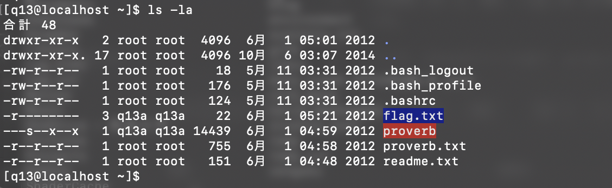

# ksnctf Q.13 Proverb

問題には ssh 先のアドレスとパスワードが載っている。

「pwn かな」となんとなく思いながらサーバーにアクセスする。

サーバーに入り、とりあえず ls -la。
readme.txt と、他に flag.txt proverb.txt proverb の 4 つファイルがあった。

ここで、これらのファイル全て、write 権限が無いことに気づく。

ディレクトリにも書き込み権限はない。

さらに read 権限も厳しくついているため、gdb 　や hexdump で proverb を見れない。

さっぱりわからず、とりあえず proverb を実行しまくる。

しかし、ランダムに proverb.txt に書き込まれた名言を標準出力に表示するだけで、
他に何もわからない。

「なんじゃこれ...」

30 分くらいたち、万策尽きて全然わからんので、write up 　でヒントをもらいに行く。

恐る恐る write up をスクロールすると、なにやら /tmp/proverb.txt が存在し、

その中身には 「Please make your own subdirectory.」と書いてあるらしい。

自分でも確認してみたが、/tmp/proverb.txt はあったが中身は ~/proverb.txt と同じものであった。

少々がっくりしながら、/tmp 以下にディレクトリを作成してみる。

作成したディレクトリの中では、ファイルを作成できる。(tmp でも同じだが)

ここで flag.txt や proverb.txt を mv したり cp したりして、ここでまた行き詰まる。

もう少し write up をスクロールしてみると、 何やら ~　以外で ~/proverb を実行するとエラーが出るという。

（これは...?)

と思いながら実行してみる。

すると同様にエラーが。

ここで、権限上 flag.txt を mv や cp できないことは確認ずみで、proverb 自体も何も引数も取らないため、このディレクトリに proverb.txt を用意しなければならない。

ここで、シンボリックファイルの存在を思い出す。

ここに proverb.txt というファイル名で~/flag.txt にリンクすれば良いのでは無いか..?

これが大当たりで、無事 flag.txt の中身が表示された。

## 感想

この脆弱性は、ファイルの読み取りを相対パスではなく、絶対パスで設定すれば防げたのかもしれない。

作ったシンボリックファイルを cat してみたところ、権限がありませんと表示され、読めなかった。

どういう条件が揃うと、こういったことが可能になるのか微妙にわからない。

proverb は **setuid** が設定されていたが、これが関係しているのだろうか。

あ、多分そうだ。

setuid は実行したユーザーの権限ではなく、ファイルの所有者の権限で実行されるんだった。

proverb と flag.txt の所有者はどちらも q13a というユーザーだ。

cat で表示されないのは、実行ユーザーが q13 だからなんだ。

解決した。setuid 危険っすね
