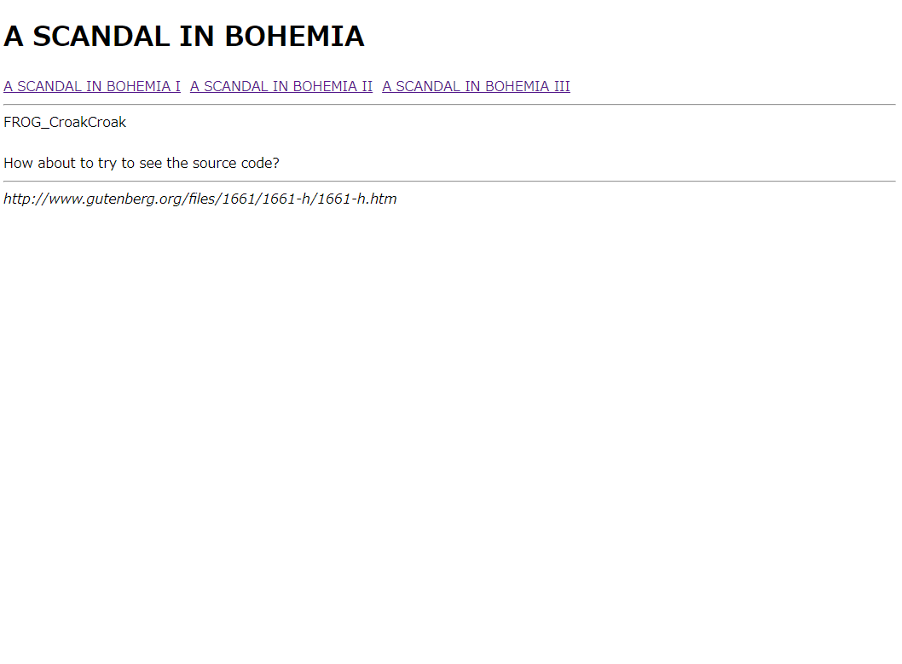

## 問題の概要

問題ページへのリンクが張られている。

問題ページでは、シャーロックホームズの「ボヘミアの醜聞」の原文が載っている。

プロジェクトグーテンベルクから持ってきたようだ。

## 色々調べる

なんかめんどくさそうだなと思いながら、とりあえず色々調べてみよう。

ぱっとみ普通の html っぽいが、ソースを見てみる。

特に変なところはないが、url をよく見ると index.pl となっている。

perl だ。CGI だな。

ディレクトリトラバーサルを試みると、index.pl のあるディレクトリのファイルが表示された。

すると、flag.txt がある。ほかには、「ボヘミアの醜聞」の素となると思われる txt がある。

url 的に、index.pl/{ファイル名へのパス}という形でそのファイルの中身が表示されているようだ。

というわけで、さっそく index.pl/flag.txt へアクセスしてみる。



まあそうだよね。（ﾁｯ）

ははぁソースコードをみろと、なるほど。

index.pl/index.pl にアクセスすると、ソースコードを見ることができた。

```perl
#!/usr/bin/perl
use CGI;

print <<'EOS';
Content-type: text/html; charset=utf-8

<!DOCTYPE html>
<html>
<head>
<title>A SCANDAL IN BOHEMIA</title>
</head>
<body>
<h1>A SCANDAL IN BOHEMIA</h1>
<div>
<a href="/~q26/index.pl/a_scandal_in_bohemia_1.txt">A SCANDAL IN BOHEMIA I</a>&nbsp;
<a href="/~q26/index.pl/a_scandal_in_bohemia_2.txt">A SCANDAL IN BOHEMIA II</a>&nbsp;
<a href="/~q26/index.pl/a_scandal_in_bohemia_3.txt">A SCANDAL IN BOHEMIA III</a>&nbsp;
</div>
<hr>
<div>
EOS


# Can you crack me? :P
open(F,'cracked.txt');
my $t = <F>;
chomp($t);
if ($t eq 'h@ck3d!') {
print 'FLAG_****************<br><br>';
}
unlink('cracked.txt');
####


open(F,substr($ENV{'PATH_INFO'},1));

my $cgi = new CGI;
$cgi->charset('utf-8');
while(<F>) {
chomp;
s/FLAG_\w+/FLAG_****************/g;
print $cgi->escapeHTML($_)."<br>\n";
}

print <<'EOS';
</div>
<hr>
<address>
http://www.gutenberg.org/files/1661/1661-h/1661-h.htm
</address>
</body>
</html>
```

途中に明らかに怪しい箇所がある。

```perl
# Can you crack me? :P
open(F,'cracked.txt');
my $t = <F>;
chomp($t);
if ($t eq 'h@ck3d!') {
print 'FLAG_****************<br><br>';
}
unlink('cracked.txt');
####
```

うーむ、cracked.txt を開いてその中身が`h@ck3d!`だったら FLAG\_が表示されるのか。（雰囲気）

perl cgi の脆弱性を調べてみると、何やら open 関数に脆弱性があり、ファイル名をコマンドとして解釈し、実行できるらしい。
方法はファイル名の最後に"|"と入れるだけ。

そういうモードが存在し、モードが指定されていなければ、ファイル名から指定できるらしい。

というわけで、index.pl/echo%20"h@ck3d!"%20>%20cracked.txt%7C
(echo "h@ck3d!" > cracked.txt|)

にアクセスしてファイルを作成して終了だ。

# 感想

OS command injection というらしい

これも任意コマンドをリモートで実行可能だから、重大な脆弱性だが、対策もしやすい。

しかし、うっかりやってしまいそうで怖い。

けど perl で、しかも CGI 使う機会って全然なさそう
