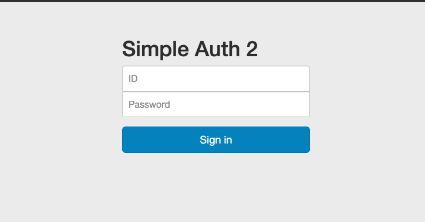

## 問題の概要

問題のページとソースコードが見られる。

問題ページはこんな感じで、ID と password 入力フォームがある。

適当に id, pass と指定して送信すると、同じ画面で
「Incorrect ID or password」
と表示された。

## 足掻き

ソースコードも見てみると、問題通りのシンプルなログイン機構だった。

flag はデータベース内のデータのパスワードのようだ。

ログインがうまくできれば、flag としてそのユーザーのパスワードが表示される。

前回の問題に当たる「Q.32 simple auth」では、php の緩い比較「==」の仕様をつくことでフラグを入手できた。

今回はどこも比較には厳密な「===」や「!==」を使っており、

sql もプレースホルダーを使っている。

怪しいそうな関数を色々調べ、php の[任意コード実行](/2020/ksnctf/12/write_up/)も試してみたがダメった。

ディレクトリトラバーサルを試したりなんだりして 1 時間くらい経過した。

いつも write up をみるのは負けた気がするで気が引けているのだが、しょうがない。

勉強のためだと思って write up からヒントをもらいに行いこう。

問題の名前で調べて一番上に出てきたものをクリックし、恐る恐るスクロールする。

スクロールしすぎないよう注意深く読む。

自分と同じように色々試した様子が綴られている中で、ログインに使っているデータベースのファイル名に言及する節にたどり着いた。

画面をソースコードに戻して確認してみると、確かにデータベースのファイル名は相対アドレスで指定されている。

なるほど。この php ファイルと同じディレクトリにデータベースファイルがあるということだ。

つまりリンクからこの db ファイルが見れるかもしれない。

url auth.php 　を database.db に変えてみると、その通り database.db がダウンロードできた。

これの中身をみれば flag ゲットだ。

db はごく普通に中身をみることができた。

# 感想

データベースファイルを直に入手するという発想はまるでなかった。

ログインは突破していないが、ログイン突破する以上にまずい状況だ。

これは web サーバーの設定の問題だろうか？
