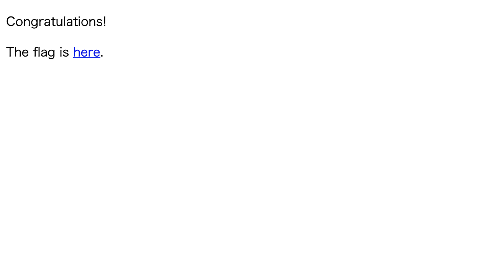

# Ksnctf Q.9 Digest is secure!

Digest 認証の問題。

問題ページに pcap が配布されているので、とりまダウンロードして悠々と WireShark で開く。

ぱっと見で、Digest 認証を通過して、二つのページを取得している模様。

Wireshark はすごくて、この pcap ファイルから html ファイルを生成することができる。

そうすると、3 つのファイルか吐き出された。

うち二つは 401 と、その後の 200 の普通の html ファイルで、もう一つが htdigest というファイルだった。

とりあえず 200 の html ファイルを開く。するとなんと「The flag is here.」というメッセージが。

当然これで終わりないと思いつつも、わずかに期待を持ちながら here を押すと/flag.html に飛んだ。

つまり、flag はこの pcap のやりとりのホスト/flag.html にあるということだ。

早速、pcap からホストを見つけてきて、/flag.html にアクセスしてみる。

すると、digest 認証のフォームがある。

やはり digest 認証を突破しなければならないようだ。

## Digest 認証を調べる。

digest 認証は、basic 認証のセキュアなバージョンという感じで、basic 認証のノリの認証を、パスワードを隠して行うことができる認証方法だ。

サーバーで digest 認証を設定するには、サーバー側でパスワードとユーザー名を設定し、「**htdigest**」というファイルを生成する。

htdigest ファイルの中身は「ユーザ名:レルム名:MD5 値」という構成になっている
ここで、MD5 値は「ユーザ名:レルム名:パスワード」となっている。

ここが重要である。

通常、Digest 認証をしようとすると、たいてい「ユーザー名」と「パスワード」の入力が求められる。しかし、パスワードを直にやりとりしないという特性上、これらから別の値を生成する必要がある。つまり、実際に認証に使うのはこれらの値を使って導いたべつの値となる。その値がまさに MD5 値なのだ。

そしてなんと、pcap から生成されたファイルの中に「htdigest」というファイル名があった。

ここにはしっかりと前述した通りの内容が書き込まれており、あとはこれらの値を使って認証すれば、フラグゲットとなる。

パスワードは以前わからないままだが、認証を通り抜けることが可能となった。

# 感想

Digest 認証は所詮 basic 認証でパスワードを隠すためのものであり、通信を暗号化するものではないということを思い知った。やっぱり ssl であることが重要なのかな。
