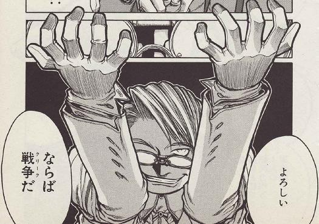

先日、研究室の輪講で情報検索系の技術を実装する課題があった。

内容としては、転置インデックスを作成して、tf-idf や bm25 をステップバイステップで実装していく内容だ。

同期のメンバーはプログラミングに慣れてない人が多いようで、そのなかでは僕は慣れているほうのようだ

毎週一人が実装した内容を解説するという感じで輪講は進められていく。

ソースコードは各人が github にプッシュすることになっている。

今週の課題は今までのものと比較すると、難しい内容だった。

そんな今週、僕のコードを正面からパクられるという自体が発生した。

## コードをパクるって?

他人が解説しているコードをコピペすることはよくあるだろう。

Qiita 等で「python で excel を開く方法」みたいな記事から、取り上げられているコードの一部を持ってくるといった感じのことはカジュアルに行われているし、ある程度許容されているように思う。
（特に部分的であれば）

しかし、それを「私がやりました」もしくは「コピペしてない」と言い張るのは御法度だ。

そう、今日解説を担当した同期のコードは、変数名、関数名、中身の処理と、95%くらい僕のコードと一致しているのにもかかわらず、「〇〇さん（別の同じ研究室の人）のコードを参考にした」と言い張ったのだった。

最初、僕は〇〇さんと僕のソースコードを勘違いしているなと思っていた。そのため、「僕のソースコードを参考にしたわけじゃないですか？」と確認してみた。その人は僕のソースコードをその場で確認しながら「いや、ｯｽｰ、そうですね、僕は〇〇さんのを参考にしました」と。

一応言っておくと、その〇〇さんのソースコードとは設計が全然違う。

一方で、僕が工夫して書いた部分や、要件にはないけど便利だからと追加した機能もそっくりそのまま入っていた。

僕は「関数名とか同じでー」とかいって念を押してみたがダメそうだったので、これは戦争を申し込まれたのだと解釈して、僕はこれからの研究室生活を想いながら覚悟を決めたのだった...

## 雑記

愚痴っぽくなってしまったが、どうにも悶々とするのでアウトプットすることにした。

コードをコピペされ、それが発表の題材として使われると、二つのダメージが僕に入る・

1. そのコードを書いたのが僕ではなく「その人」になってしまう
2. そのコードにダメ出しが入ると、それはつまり僕のコードのダメだしとなる。

もちろん、ダメ出しを受けるのは成長に繋がるのでよいんだが、そのダメ出しを受けているのはあくまでパクったひとなので、僕から何か意見できないのがもどかしい。

僕も自分の発表担当じゃなかったから、「もう修正とかしないだろうし〜」という感じで手を抜いて書いた部分もあり、そういう部分が指摘されててもう...

参考にしてくれるのは全然いいんだけど、ほぼ丸コピだし、しかも参考にしてないっていうのは胃にくるよ...
